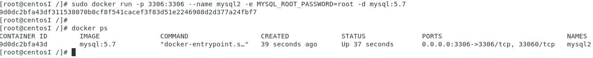

[toc]

## 准备docker环境

### 使用存储库安装 Docker Engine-Community

参考 [官方指南](https://docs.docker.com/install/linux/docker-ce/centos/#install-docker-ce)

在新主机上首次安装Docker Engine-Community之前，需要设置Docker存储库。之后，可以从存储库安装和更新Docker。

#### 设置存储库

* 安装所需的软件包。`yum-utils`提供了`yum-config-manager` 效用，并`device-mapper-persistent-data`和`lvm2`由需要 `devicemapper`存储驱动程序。

  ```shell
  sudo yum install -y yum-utils device-mapper-persistent-data lvm2
  ```

* 使用以下命令来设置**稳定的**存储库。

  ```shell
  sudo yum-config-manager --add-repo  https://download.docker.com/linux/centos/docker-ce.repo
  ```

#### 安装DOCKER ENGINE-社区

* 安装最新版本的Docker Engine-Community和containerd

  ```shell
  sudo yum install docker-ce docker-ce-cli containerd.io
  ```

  如果提示接受GPG密钥，请验证指纹是否匹配 `060A 61C5 1B55 8A7F 742B 77AA C52F EB6B 621E 9F35`，如果是，则接受它。 

  <left></left>

### 验证 Docker 安装

* 检查 Docker 版本

  ```shell
  docker version
  ```

  <left></left>

* 启动Docker

  ```shell
  sudo systemctl start docker
  ```

* 运行 hello-world 映像来验证

  ```shell
  sudo docker run hello-world
  ```

  <left></left>
* 首次运行`sudo docker run hello-world`会提示 `Unable to find image 'hello-world:latest' locally`，之后会自动拉取最新的`Hello World` 镜像，当出现 `Hello from Docker!` 说明安装成功。

## Docker 基本操作

* 运行镜像

  ```shell
  sudo docker run -it ubuntu bash
  ```

  <left></left>

* 显示本地镜像库内容

  ```shell
  docker images
  ```

  <left></left>

* 获得帮助

  ```shell
  docker --help
  ```

  <left></left>


### 容器命令

* 显示运行中容器

  ```shell
  docker ps
  ```

  ```shell
  docker container ls
  ```

  <left></left>

* 显示所有容器（包含已中止）

  ```shell
  docker ps -a
  ```

  <left></left>

* 继续运行原容器并进入，名字对应刚刚用 `docker ps -a` 查看到的已经退出的容器

  ```shell
  docker restart youthfu_wilson
  docker ps
  docker attach youthfu_wilson
  ```
  
  <left></left>
  <left></left>

## MySQL与容器化

* 拉取 MySQL 镜像，用了梯子

  ```shell
  docker pull mysql:5.7
  docker images
  ```
  
  <left></left>

### 构建docker镜像练习

* 新建 mydock 并进入该目录，编辑 `dockerfile`

  ```shell
  mkdir mydock && cd mydock
  ```

  ```shell
  mydock]# vi dockerfile
  ```

* 录入以下内容

  ```shell
  FROM ubuntu
  ENTRYPOINT ["top", "-b"]
  CMD ["-c"]
  ```

* 构建镜像

  ```shell
  mydock]# docker build . -t hello
  ```

  <left></left>

* 运行镜像

  ```shell
  docker run -it --rm hello -H
  ```
  
  <left></left>

### 使用MySQL容器

* 启动服务器

  ```shell
  sudo docker run -p 3306:3306 --name mysql2 -e MYSQL_ROOT_PASSWORD=root -d mysql:5.7
  docker ps
  ```

  

* 启动容器内 sh 进程，然后启动 MySQL 客户端

  ```shell
  docker run -it --net host mysql:5.7 "sh"
  mysql -hmysql -P3306 -uroot -proot
  ```
  
  <left></left>
  
* mysql 客户端基本操作

  * 创建数据库test，用户表`userinfo`，详细用户信息表 `userdetail`

    ```mysql
    create database test;
    use test;
    
    CREATE TABLE `userinfo` (
        `uid` INT(10) NOT NULL AUTO_INCREMENT,
        `username` VARCHAR(64) NULL DEFAULT NULL,
        `departname` VARCHAR(64) NULL DEFAULT NULL,
        `created` DATE NULL DEFAULT NULL,
        PRIMARY KEY (`uid`)
    );
    
    CREATE TABLE `userdetail` (
        `uid` INT(10) NOT NULL DEFAULT '0',
        `intro` TEXT NULL,
        `profile` TEXT NULL,
        PRIMARY KEY (`uid`)
    )
    ```

    <left></left>
    
    <left></left>

### 挂载卷保存db

* 查看数据库文件

  ```shell
  docker exec -it mysql2 bash
  ls /var/lib/mysql
  ```

  <left></left>

* Dockerfile 的 VOLUME /var/lib/mysql 的含义

  ```shell
  docker container prune -f
  ```
  
  <left></left>

  ```shell
  docker volume prune -f
  ```
  
  <left></left>
  
  ```shell
  docker volume ls
  ```
  
  <left></left>

### 创建卷并挂载

* 执行

  ```shell
  docker rm $(docker ps -a -q) -f -v
  docker volume create mydb
  docker run --name mysql2 -e MYSQL_ROOT_PASSWORD=root -v mydb:/var/lib/mysql -d mysql:5.7
  ```

  <left></left>

### 启动客户端容器链接服务器

* 使用了 --link 连接两个容器

  ```shell
  docker run --name myclient --link mysql2:mysql -it mysql:5.7 bash
  env
  ```

  <left></left>

* 客户端容器内可以使用 mysql 这个别名访问服务器

  ```shell
  mysql -hmysql -P3306 -uroot -proot
  ```

  <left></left>

