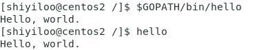
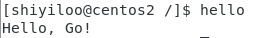
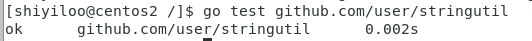

# 第一个 Golang 程序

## 第一个程序

### 创建包路径和 go 源码

* `$GOPATH`为 go 程序的工作空间位置，我的设置为`GOPATH=$HOME/gowork`，另外，`github.com/user` 将作为本次测试的基本路径，之后的包将建立在其下。

* 以普通用户权限，在`$GOPATH`中创建程序的包目录

  ```bash
  mkdir -p $GOPATH/src/github.com/user/hello
  ```

* 在hello目录中创建一个名为 `hello.go` 的文件

  ```bash
  vi $GOPATH/src/github.com/user/hello/hello.go
  ```

* 写入以下代码

  ```go
  package main
  
  import "fmt"
  
  func main() {
  	fmt.Printf("Hello, world.\n")
  }
  ```

### 安装和运行程序

*  使用 go 工具构建并安装此程序

  ```bash
  go install github.com/user/hello
  ```

  或者

  ```bash
  cd $GOPATH/src/github.com/user/hello
  go install
  ```

  * `go install`命令会构建 hello 产生一个可执行的二进制文件，接着该二进制文件会被安装到工作空间的 `bin` 目录中，即 `$GOPATH/bin/hello`，也就是 `$HOME/gowork/bin/hello`。
  * `go` 工具只有在发生错误时才会打印输出，因此若安装时没有产生输出，就表明执行成功。

* 运行安装好的程序

  输入其绝对路径来执行

  ```bash
  $GOPATH/bin/hello
  ```

  若已经将 `$GOPATH/bin` 添加到 `PATH` 中了，那么可以直接输入二进制文件名

  ```bash
  hello
  ```

  结果如下

  

  

## 第一个库

### 创建包路径和 go源码

* 现在编写一个库，并让 `hello`程序来使用它。

* 同样，先选择包路径并创建包目录

  ```bash
  mkdir $GOPATH/src/github.com/user/stringutil
  ```

* 在 `stringutil` 路径下创建名为 `reverse.go` 的文件，写入如下代码

  ```bash
  vi $GOPATH/src/github.com/user/stringutil/reverse.go
  ```

  ```go
  // stringutil 包含有用于处理字符串的工具函数。
  package stringutil
  
  // Reverse 将其实参字符串以符文为单位左右反转。
  func Reverse(s string) string {
  	r := []rune(s)
  	for i, j := 0, len(r)-1; i < len(r)/2; i, j = i+1, j-1 {
  		r[i], r[j] = r[j], r[i]
  	}
  	return string(r)
  }
  ```

### 编译测试库文件

* 用 `go build` 命令来编译 `reverse.go` 文件

  ```bash
  go build github.com/user/stringutil
  ```

  或者你在源码目录中，直接输入 `go build`

* 确认 `stringutil` 包构建完毕后，修改原来的 `hello.go`文件

  ```
  vi  $GOPATH/src/github.com/user/hello/hello.go
  ```

  修改为

  ```bash
  package main
  
  import (
  	"fmt"
  	"github.com/user/stringutil"
  )
  
  func main() {
  	fmt.Printf(stringutil.Reverse("\n!oG ,olleH"))
  }
  ```

### 重新安装和运行程序

* 同样，用 `go install` 安装二进制文件，`stringutil`包将被自动安装。

  ```bash
  go install github.com/user/hello
  ```

* 然后运行此程序的新版本，会得到与代码中字符串反向的消息

  


### 工作空间目录

* 到现在，工作空间结构如下

>**bin/**
>
>* hello                 # 可执行命令
>
>**pkg/**
>
>* linux_amd64/          # 这里会反映出你的操作系统和架构
>  * github.com/user/
>    * stringutil.a  # 包对象
>
>**src/**
>
>* github.com/user/
>  * hello/
>    * hello.go      # 命令源码
>  * stringutil/
>    * reverse.go       # 包源码


## 测试

* Go拥有一个轻量级的测试框架，它由 `go test` 命令和 `testing` 包构成。你可以通过创建一个名字以 `_test.go` 结尾的，包含名为`TestXXX` 且签名为 `func (t *testing.T)` 函数的文件来编写测试。

* 比如创建`$GOPATH/src/github.com/user/stringutil/reverse_test.go`来为 `stringutil` 添加测试。

  ```go
  package stringutil
  
  import "testing"
  
  func TestReverse(t *testing.T) {
  	cases := []struct {
  		in, want string
  	}{
  		{"Hello, world", "dlrow ,olleH"},
  		{"Hello, 世界", "界世 ,olleH"},
  		{"", ""},
  	}
  	for _, c := range cases {
  		got := Reverse(c.in)
  		if got != c.want {
  			t.Errorf("Reverse(%q) == %q, want %q", c.in, got, c.want)
  		}
  	}
  }
  ```

* 使用 `go test` 运行该测试

  ```bash
  go test github.com/user/stringutil
  ```

  结果如下

  
