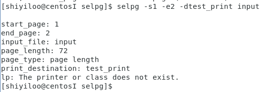

[TOC]

# go 实现命令行实用程序 selpg

## 准备

阅读 [c 语言开发的命令行实用程序 selpg](https://www.ibm.com/developerworks/cn/linux/shell/clutil/index.html)


## 代码实现

* 根据 linux 命令的使用准则，所设计的 `selpg` 命令必须带有 `-s` 和 `-e` 两个强制选项，形式为用 `-sNumber` 或 `-s Number`（其他同理） 指出开始页码，`-eNumber` 指出结束页码，可选选项有自定页长`-l`（格式 `-lNumber` 或 `l Number`），遇换页符换页 `-f` ，打印机地址 `-d`（格式 `-dDestination` 或 `-d Destination`）。其中自定页长和遇换页符换页两个选项是互斥的，不能同时输入。

* 定义`selpg_arg` 结构体用于保存解析到的选项的参数。

  ```go
  type selpg_args struct {
  	start_page  int
  	end_page    int
  	in_filename string
  	print_dest  string
  	page_len    int  /* default 72, can be overriden by "-l number" on command line */
  	page_type   bool /* default is 'l'; 'l' for lines-delimited, 'f' for form-feed-delimited */
  }
  ```

* 使用 `pflag` 包对变量进行绑定。

  ```go
  import flag "github.com/spf13/pflag"	// 重命名 pflag 为 flag
  ```

  ```go
  func get_args(sa *sp_args) {
  	flag.IntVarP(&sa.start_page, "start_page", "s", -1, "start page")
  	flag.IntVarP(&sa.end_page, "end_page", "e", -1, "end page")
  	flag.IntVarP(&sa.page_len, "page_length", "l", 72, "page len")
  	flag.StringVarP(&sa.print_dest, "print_dest", "d", "", "print destination")
  	flag.BoolVarP(&sa.page_type, "page_type", "f", false, "page type")
  	flag.Parse()
  }
  ```

  * 绑定时，如果选项对应的变量是 `int` 型变量就用 `flag.IntVarP()`绑定，如果是 `string` 型变量就用 `flag.String()` 绑定，类型对应即可。
  * 调用 `flag.Parse()` 对输入的命令进行解析，解析好的值将保存在绑定好的变量（也就是传入的 `sa` 结构体中）中。

* 从命令行解析得到的变量，可能有错，需要进行检查。因为 `flag` 解析时已经检查了一些输入上的错误，所以我们只需要检查其值是否正确。如果全部符合要求，则打印选项变量。

  * 按照以上 `selpg_args` 定义变量的顺序对变量进行检查。

  ```go
  func check_args(sa *sp_args) {
  	/* Not enough args, minimum command is "selpg -sstartpage -eend_page"  */
  	if len(os.Args) < 3 {
  		fmt.Fprintf(os.Stderr, "\n%s: not enough arguments\n", progname)
  		flag.Usage()
  		os.Exit(1)
  	}
  	/* handle mandatory args first */
  	/* handle arg - start_page -s*/
  	if (sa.start_page <= 0) || (sa.start_page > INT_MAX) {
  		fmt.Fprintf(os.Stderr, "\n%s: invalid start page %d\n", progname, sa.start_page)
  		flag.Usage()
  		os.Exit(2)
  	}
  	/* handle arg - end page -e*/
  	if (sa.end_page <= 0) || (sa.end_page > INT_MAX) || (sa.end_page < sa.start_page) {
  		fmt.Fprintf(os.Stderr, "\n%s: invalid end page %d\n", progname, sa.end_page)
  		flag.Usage()
  		os.Exit(3)
  	}
  
  	/* now handle optional args */
  	/* handle arg - page_len -l*/
  	if (sa.page_len < 1) || (sa.page_len > INT_MAX) {
  		fmt.Fprintf(os.Stderr, "\n%s: invalid page length %d\n", progname, sa.page_len)
  		flag.Usage()
  		os.Exit(4)
  	}
  	/* handle arg - page_type -f */
  	if (true == sa.page_type) && (sa.page_len != 72) {
  		fmt.Fprintf(os.Stderr, "\n%s: command -l and -f are exclusive\n", progname)
  		flag.Usage()
  		os.Exit(5)
  	}
  	/* arg - print_dest -d is elided */
  
  	/* there is one more arg - in_filename*/
  	if len(flag.Args()) > 0 {
  		_, err := os.Stat(flag.Args()[0])
  		if err != nil && os.IsNotExist(err) {
  			fmt.Fprintf(os.Stderr, "\n%s: input file %s doesn't exist\n", progname, sa.in_filename)
  			os.Exit(6)
  		}
  		sa.in_filename = flag.Args()[0]
  	} else {
  		sa.in_filename = ""
  	}
  
  	page_type := "page length"
  	if sa.page_type == true {
  		page_type = "end sign \f"
  	}
  	fmt.Fprintf(os.Stdout, "\nstart_page: %v", sa.start_page)
  	fmt.Fprintf(os.Stdout, "\nend_page: %v", sa.end_page)
  	fmt.Fprintf(os.Stdout, "\ninput_file: %s", sa.in_filename)
  	fmt.Fprintf(os.Stdout, "\npage_length: %d", sa.page_len)
  	fmt.Fprintf(os.Stdout, "\npage_type: %s", page_type)
  	fmt.Fprintf(os.Stdout, "\nprint_destination: %s\n", sa.print_dest)
  }
  ```

  * 因为形如 `-s` ，`-l` ，`-f` 这样的选项都是要求带 `-` 的，之后可以再跟一个参数或不跟（比如 `-s5` 或者 `-s 5` 表示从第 5 行开始）这样的输入 `pflag` 能直接解析到。
  * 但单独的一个没有 `-` 选项的参数 `pflag` 不会解析，而是把它当为单独的参数，`pflag.Args()`保存了未带 `-` 选项的参数，本代码中将得到用户指定的输入文件名。

* 确认变量值无误后，就可以处理这些变量了。

  * 获取输入流，如果用户输入了输入文件名，则检查对应的文件是否能打开；
  * 找到输出流，并调用 `process_print` 进行输出。如果用户使用了 `-d` 命令指定输出到打印机，则需要创建到打印机的管道进行输出。

  ```go
  func process_input(sa *sp_args) {
  	/* set the input source */
  	var fin *os.File
  	if sa.in_filename == "" {
  		fin = os.Stdin
  	} else {
  		var err error
  		fin, err = os.Open(sa.in_filename)
  		if err != nil {
  			fmt.Fprintf(os.Stderr, "\n%s: could not open input file \"%s\"\n", progname, sa.in_filename)
  			os.Exit(7)
  		}
  		defer fin.Close() /* delay this close */
  	}
  
  	/* set the output destination */
  	var fout io.WriteCloser
  	if len(sa.print_dest) == 0 {
  		fout = os.Stdout
  		process_print(fout, fin, *sa) /*call process_print to print pages*/
  	} else {
  		fout = create_pipe(sa.print_dest)
  		process_print(fout, fin, *sa)
  		defer fout.Close() /* delay this close */
  	}
  }
  ```

  * 用 `lp -d` 命令连接到打印机。

    ```go
    func create_pipe(dest string) io.WriteCloser {
    	var cmd *exec.Cmd
    
    	cmd = exec.Command("lp", "-d"+dest)
    	cmd.Stdout = os.Stdout
    	cmd.Stderr = os.Stderr
    
    	fout, err := cmd.StdinPipe()
    	if err != nil {
    		log.Fatalln(err)
    	}
    
    	err = cmd.Start()
    	if err != nil {
    		fmt.Fprintln(os.Stderr, "pipe")
    		log.Fatal(err)
    	}
    	return fout
    }
    ```

* 输出指定页码内容到输出流。

  ```go
  func process_print(fout interface{}, fin *os.File, sa sp_args) {
  	line_ctr, page_ctr, next_page := 0, 1, 1
  	buf := bufio.NewReader(fin)
  	var err error
  	for true {
  		var line string
  		if sa.page_type { /*page type f*/
  			line, err = buf.ReadString('\f')
  			next_page = page_ctr + 1
  		} else {
  			line, err = buf.ReadString('\n')
  			line_ctr++
  			if line_ctr > sa.page_len {
  				page_ctr++
  				next_page = page_ctr
  				line_ctr = 1
  			}
  		}
  
  		if err == io.EOF {
  			//fmt.Fprintln(os.Stderr, "[EOF]")
  			break
  		} else if err != nil {
  			log.Fatal(err)
  		}
  
  		if page_ctr >= sa.start_page && page_ctr <= sa.end_page {
  			if std_out, ok := fout.(*os.File); ok {
  				_, err = fmt.Fprintf(std_out, "%s", line)
  			} else if std_pipe, ok := fout.(io.WriteCloser); ok {
  				_, err = std_pipe.Write([]byte(line))
  			} else {
  				fmt.Fprintf(os.Stderr, "\n[Error]: fout type error\n")
  				os.Exit(9)
  			}
  			if err != nil {
  				log.Fatal(err)
  			}
  		}
  		page_ctr = next_page
  	}
  
  	if page_ctr < sa.start_page {
  		fmt.Fprintf(os.Stderr, "\n%s: start_page(%d) greater than total pages (%d), no output written\n", progname, sa.start_page, page_ctr)
  		os.Exit(10)
  	} else if page_ctr < sa.end_page {
  		fmt.Fprintf(os.Stderr, "\n%s: end_page (%d) greater than total pages (%d), less output than expected\n", progname, sa.end_page, page_ctr)
  		os.Exit(10)
  	}
  }
  ```

  

## 测试结果

为了方便测试，先利用 selpg 中的 `write_file()` 创建了一个 `input` 文件，向其中输入 100 行内容，每 50 行输入一个 '\f' 字符用于之后的 `-f` 命令的测试。

```bash
selpg -s1 -e1 input
```

<left></left>
<left></left>
```bash
// 重定向输入流
selpg -s1 -e1 <input
```

<left></left>
```
// 重定向输出流
selpg -s1 -e1 input >out
```

<left></left>
```
// 重定向错误输出
selpg -s1 -e3 input 2>error
```

<left></left>
<left></left>
```
// 同时重定向输出流和错误输出
selpg -s2 -e3 input >out 2>error
```

<left></left>
<left></left>
```
// 使用 -f 选项计算页数，page_type 改变为 end_sign（输入文件中每 50 行有一个 \f 字符）
selpg -s1 -e1 -f input
```

<left></left>
<left></left>
```
// 其他命令的输出作为 selpg 命令的输入
cat input | selpg -s1 -e2
```

<left></left>
```
// selpg 命令的输出其他命令的输入
selpg -s1 -e2 input | wc
```

<left></left>
```
// 重定向错误输出到 /dev/null
selpg -s1 -e1 input >out 2>/dev/null
```

<left></left>
```
// 使用 -l 选项输出 4 页，每页 24 行，共 96 行
selpg -s1 -e4 -l24 input
```

<left></left>
<left></left>
```
// 从打印机输出，因为未连打印机，所以 lp 命令显示打印机不存在
selpg -s1 -e2 -dtest_print input
```

<left></left>